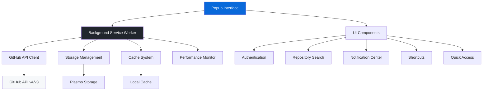
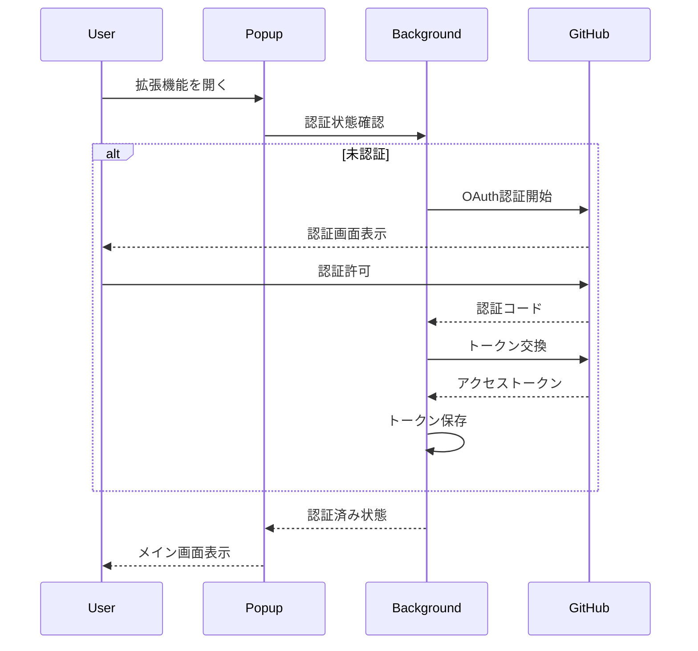
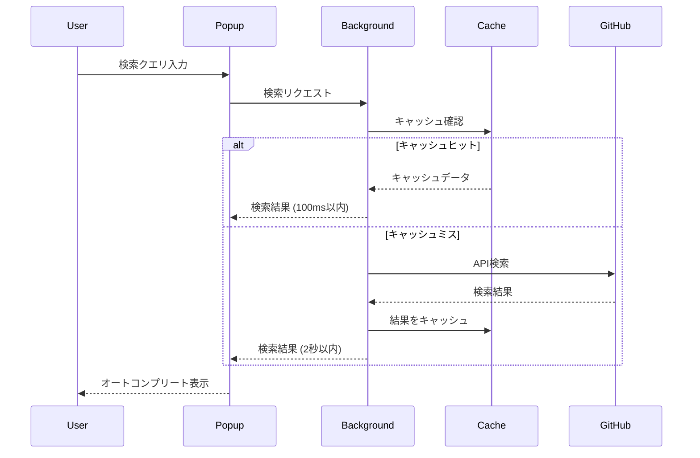
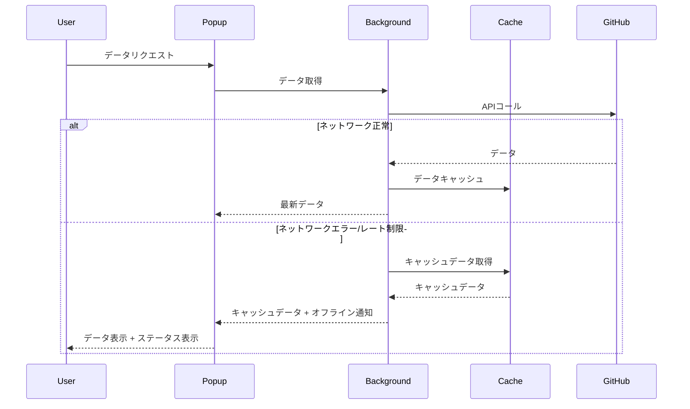
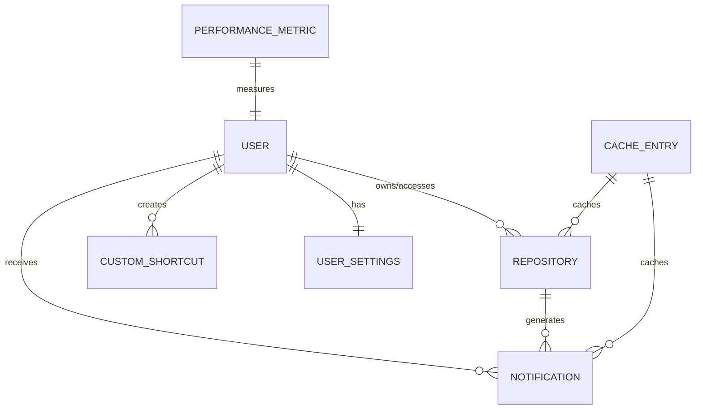
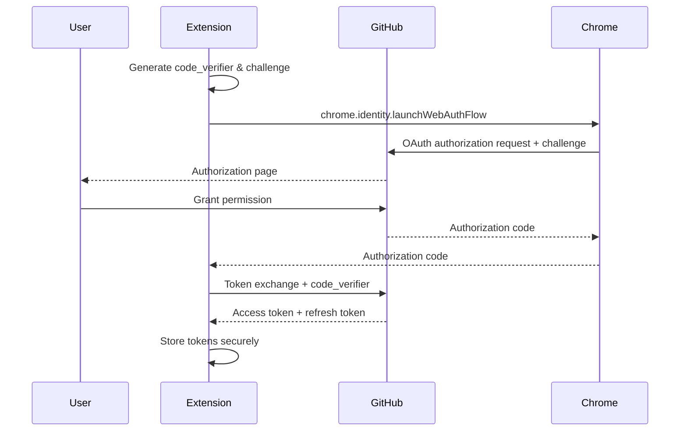

# Technical Design

## Overview

GitHub NavigatorはPlasmoフレームワークを使用したChrome拡張機能の技術設計文書です。React 19、TypeScript 5.8.3、shadcn/ui、Tailwind CSS v4.1.11を活用し、GitHubリポジトリ管理、通知センター、カスタムショートカット、クイックアクセス機能を提供します。GitHub Primerデザインシステムに準拠し、オフライン対応とパフォーマンス最適化を重視した設計により、開発者の生産性向上を実現します。

## Requirements Mapping

### Design Component Traceability

各設計コンポーネントは特定の要件に対応しています：

- **Authentication Module** → REQ-1: OAuth認証とリポジトリアクセス
- **Repository Search Component** → REQ-2: リポジトリ選択とオートコンプリート検索
- **Notification Center** → REQ-3: 通知管理とフィルタリング
- **Shortcuts Management** → REQ-4: カスタムショートカット機能
- **Quick Access Panel** → REQ-5: クイックアクセス機能
- **Theme System** → REQ-6: テーマとダークモード対応
- **i18n System** → REQ-7: 多言語対応
- **Error Handling Layer** → REQ-8: エラーハンドリングとユーザビリティ
- **Cache Management** → REQ-9: オフライン対応とキャッシュ機能
- **Performance Optimization** → REQ-10: パフォーマンス最適化

### User Story Coverage

- **認証フロー**: GitHubアカウントでの安全な認証とトークン管理
- **リポジトリ検索**: リアルタイムオートコンプリートによる効率的なリポジトリ選択
- **通知管理**: フィルタリング機能付きの一元的な通知管理
- **カスタムショートカット**: よく使うページへの効率的なアクセス
- **クイックアクション**: Issues、PR、Projectsへの素早いナビゲーション
- **テーマ切り替え**: ダーク/ライト/システムテーマの自動対応
- **多言語対応**: 日本語・英語での完全なUI表示
- **オフライン機能**: ネットワーク障害時のキャッシュデータ表示
- **高速動作**: 300ms以下のポップアップ表示とスムーズなUX

## Architecture

### システムアーキテクチャ



### Technology Stack

プロジェクトの既存技術スタックに基づく構成：

- **フレームワーク**: Plasmo v0.90.5 (Chrome拡張機能専用フレームワーク)
- **Frontend**: React 19 + TypeScript 5.8.3
- **UI Framework**: shadcn/ui (46コンポーネント導入済み) + Tailwind CSS v4.1.11
- **アイコン**: Lucide React v0.525.0 + Octicons React v19.15.3
- **認証**: GitHub OAuth 2.0 + Chrome Identity API
- **ストレージ**: Plasmo Storage API + Chrome Storage API
- **通知**: sonner v2.0.6 (トースト通知)
- **フォーム**: react-hook-form v7.60.0 + zod v4.0.5
- **テーマ**: next-themes v0.4.6 (GitHub Primerカラーパレット)
- **テスト**: Vitest + React Testing Library + Playwright (E2E)
- **ビルド**: Parcel (Plasmo経由) + TypeScript

### Architecture Decision Rationale

- **Why Plasmo**: Chrome拡張機能開発に特化、Manifest V3対応、React統合、ホットリロード対応
- **Why React 19**: 最新のパフォーマンス最適化機能、Concurrent Features、Server Components対応
- **Why shadcn/ui**: アクセシブル、GitHubライクなUI、46コンポーネント導入済み、カスタマイズ性
- **Why Plasmo Storage**: 拡張機能間の安全なデータ共有、暗号化対応、リアクティブ更新
- **Why GitHub Primer**: GitHubユーザーに馴染みのあるデザイン言語、一貫したUX

## Data Flow

### Primary User Flows

#### 1. 認証フロー



#### 2. リポジトリ検索フロー



#### 3. オフライン対応フロー



## Components and Interfaces

### Backend Services & Method Signatures

#### Authentication Service

```typescript
class AuthenticationService {
    async initializeAuth(): Promise<void> // OAuth認証フロー開始
    async exchangeCodeForToken(code: string): Promise<string> // 認証コードをトークンに交換
    async refreshToken(): Promise<string> // トークン更新
    async logout(): Promise<void> // ログアウト処理
    async validateToken(): Promise<boolean> // トークン有効性検証
}
```

#### Repository Service

```typescript
class RepositoryService {
    async searchRepositories(query: string): Promise<Repository[]> // リポジトリ検索
    async getUserRepositories(): Promise<Repository[]> // ユーザーリポジトリ取得
    async getRepository(owner: string, repo: string): Promise<Repository> // 特定リポジトリ取得
    async getFavoriteRepositories(): Promise<Repository[]> // お気に入りリポジトリ
}
```

#### Notification Service

```typescript
class NotificationService {
    async getNotifications(): Promise<Notification[]> // 通知一覧取得
    async markNotificationAsRead(id: string): Promise<void> // 通知既読化
    async markAllNotificationsAsRead(): Promise<void> // 全通知既読化
    async filterNotifications(type: NotificationType): Promise<Notification[]> // 通知フィルタリング
}
```

#### Cache Service

```typescript
class CacheService {
    async get<T>(key: string): Promise<T | null> // キャッシュ取得
    async set<T>(key: string, value: T, ttl?: number): Promise<void> // キャッシュ保存
    async invalidate(pattern: string): Promise<void> // キャッシュ無効化
    async cleanup(): Promise<void> // 期限切れキャッシュ削除
}
```

### Frontend Components

| Component          | Responsibility                 | Props/State Summary                  |
| ------------------ | ------------------------------ | ------------------------------------ |
| AuthProvider       | 認証状態管理とコンテキスト提供 | user, isAuthenticated, login/logout  |
| RepositorySearch   | リポジトリ検索UI               | query, results, onSelect, loading    |
| NotificationCenter | 通知一覧表示と管理             | notifications, filters, unreadCount  |
| ShortcutManager    | カスタムショートカット管理     | shortcuts, onAdd/Edit/Delete         |
| QuickAccessPanel   | クイックアクションボタン群     | selectedRepo, actions                |
| ThemeToggle        | テーマ切り替えUI               | theme, onThemeChange                 |
| PerformanceMonitor | パフォーマンス計測             | metrics, renderTime, apiResponseTime |
| OfflineIndicator   | オフライン状態表示             | isOnline, rateLimitStatus            |

### API Endpoints (GitHub API Integration)

| Method | Endpoint              | Purpose            | Cache TTL | Error Handling  |
| ------ | --------------------- | ------------------ | --------- | --------------- |
| GET    | /user                 | 現在ユーザー情報   | 1時間     | 401→再認証      |
| GET    | /user/repos           | ユーザーリポジトリ | 24時間    | Rate limit対応  |
| GET    | /search/repositories  | リポジトリ検索     | 15分      | 指数バックオフ  |
| GET    | /notifications        | 通知一覧           | 5分       | オフライン対応  |
| PATCH  | /notifications/{id}   | 通知既読化         | -         | リトライ3回     |
| GET    | /repos/{owner}/{repo} | リポジトリ詳細     | 15分      | 404ハンドリング |

## Data Models

### Domain Entities

1. **User**: 認証ユーザー情報
2. **Repository**: GitHubリポジトリ情報
3. **Notification**: GitHub通知情報
4. **CustomShortcut**: ユーザー定義ショートカット
5. **UserSettings**: ユーザー設定情報
6. **CacheEntry**: キャッシュエントリ情報
7. **PerformanceMetric**: パフォーマンス測定データ

### Entity Relationships



### Data Model Definitions

```typescript
interface User {
    id: number
    login: string
    name: string
    avatar_url: string
    html_url: string
}

interface Repository {
    id: number
    name: string
    full_name: string
    owner: User
    private: boolean
    description?: string
    language?: string
    stargazers_count: number
    html_url: string
    clone_url: string
}

interface Notification {
    id: string
    unread: boolean
    reason: 'mention' | 'review_requested' | 'assign' | 'subscribed'
    subject: {
        title: string
        type: 'Issue' | 'PullRequest' | 'Release' | 'Discussion'
        url: string
    }
    repository: Repository
    updated_at: string
}

interface CustomShortcut {
    id: string
    name: string
    url: string
    icon?: string
    description?: string
    category: 'repository' | 'general' | 'tools'
    order: number
    created_at: string
}

interface UserSettings {
    theme: 'light' | 'dark' | 'system'
    locale: 'en' | 'ja'
    notifications: {
        enabled: boolean
        pollInterval: number // minutes
    }
    shortcuts: {
        showInPopup: boolean
        maxVisible: number
    }
}

interface CacheEntry<T = any> {
    key: string
    data: T
    expires_at: number
    created_at: number
    hit_count: number
}

interface PerformanceMetric {
    id: string
    type: 'popup_load' | 'api_response' | 'cache_hit' | 'render_time'
    value: number // milliseconds
    timestamp: number
    context?: Record<string, any>
}
```

### Storage Schema

#### Plasmo Storage Keys

```typescript
// 認証関連
'github_access_token': string
'github_refresh_token': string
'user_profile': User

// ユーザー設定
'user_settings': UserSettings
'custom_shortcuts': CustomShortcut[]

// キャッシュ
'cache_repositories': CacheEntry<Repository[]>
'cache_notifications': CacheEntry<Notification[]>
'cache_search_results': Record<string, CacheEntry<Repository[]>>

// パフォーマンス
'performance_metrics': PerformanceMetric[]
'performance_config': {
  enabled: boolean;
  sampleRate: number;
  maxEntries: number;
}
```

### Migration Strategy

- **バージョン管理**: 設定スキーマのバージョニング
- **後方互換性**: 旧バージョンからの自動マイグレーション
- **データ変換**: 型安全なデータ変換関数
- **キャッシュ戦略**: 段階的なキャッシュ移行

## Error Handling

### エラー処理戦略

#### Error Types & Handling

```typescript
// カスタムエラー型
class GitHubAPIError extends Error {
    constructor(
        public status: number,
        public message: string,
        public rateLimitReset?: number
    ) {
        super(message)
    }
}

class NetworkError extends Error {
    constructor(
        message: string,
        public retryAfter?: number
    ) {
        super(message)
    }
}

class CacheError extends Error {
    constructor(
        message: string,
        public key: string
    ) {
        super(message)
    }
}

// エラーハンドラー
class ErrorHandler {
    async handleAPIError(error: GitHubAPIError): Promise<void> {
        switch (error.status) {
            case 401:
                await this.auth.logout()
                throw new Error('認証が必要です')
            case 403:
                if (error.rateLimitReset) {
                    throw new Error(
                        `レート制限に達しました。${new Date(error.rateLimitReset * 1000).toLocaleTimeString()}に再試行してください。`
                    )
                }
                break
            case 404:
                throw new Error('リソースが見つかりません')
            default:
                throw new Error('GitHub APIエラーが発生しました')
        }
    }

    async handleNetworkError(error: NetworkError): Promise<void> {
        // 指数バックオフリトライ戦略
        const retryDelays = [1000, 2000, 4000] // 1s, 2s, 4s

        for (let i = 0; i < retryDelays.length; i++) {
            await new Promise((resolve) => setTimeout(resolve, retryDelays[i]))
            try {
                // リトライ処理
                return
            } catch (e) {
                if (i === retryDelays.length - 1) {
                    throw new Error(
                        'ネットワークエラー：接続を確認してください'
                    )
                }
            }
        }
    }
}
```

### ユーザーフィードバック

```typescript
// エラー通知システム
interface ErrorNotification {
    id: string
    type: 'error' | 'warning' | 'info'
    title: string
    message: string
    action?: {
        label: string
        onClick: () => void
    }
    duration?: number
}

// Toast通知 (sonner使用)
const showErrorNotification = (error: Error) => {
    toast.error(error.message, {
        action: {
            label: 'リトライ',
            onClick: () => handleRetry(),
        },
    })
}
```

## Security Considerations

### Authentication & Authorization

#### OAuth 2.0 Flow with PKCE



#### セキュリティベストプラクティス

```typescript
// トークン管理
class SecureTokenManager {
    async storeToken(token: string): Promise<void> {
        // Chrome Storage APIの暗号化機能を使用
        await chrome.storage.local.set({
            github_token: await this.encrypt(token),
        })
    }

    async getToken(): Promise<string | null> {
        const result = await chrome.storage.local.get('github_token')
        return result.github_token
            ? await this.decrypt(result.github_token)
            : null
    }

    private async encrypt(data: string): Promise<string> {
        // Web Crypto APIを使用した暗号化
        const key = await this.getOrCreateKey()
        const encoded = new TextEncoder().encode(data)
        const encrypted = await crypto.subtle.encrypt(
            { name: 'AES-GCM', iv: crypto.getRandomValues(new Uint8Array(12)) },
            key,
            encoded
        )
        return Array.from(new Uint8Array(encrypted))
            .map((b) => b.toString(16).padStart(2, '0'))
            .join('')
    }
}
```

### Data Protection

- **入力値検証**: zod schemaによる型安全な検証
- **XSS対策**: DOMPurifyによるHTMLサニタイズ
- **CSP適用**: Content Security Policyの厳格な設定
- **機密データ保護**: ログ出力からのトークン除外

```typescript
// 入力値検証
const repositorySearchSchema = z.object({
  query: z.string().min(1).max(100).regex(/^[a-zA-Z0-9\s\-._]+$/),
  page: z.number().int().min(1).max(100).optional(),
  per_page: z.number().int().min(1).max(100).optional(),
});

// CSP設定 (manifest.json)
{
  "content_security_policy": {
    "extension_pages": "script-src 'self'; object-src 'self'; connect-src https://api.github.com"
  }
}
```

## Performance & Scalability

### Performance Targets

| Metric                 | Target   | Measurement      | Implementation               |
| ---------------------- | -------- | ---------------- | ---------------------------- |
| Popup Load Time        | < 300ms  | Performance API  | Code splitting, lazy loading |
| API Response (Cache)   | < 100ms  | Custom timer     | Plasmo Storage optimization  |
| API Response (Network) | < 2000ms | Custom timer     | Request debouncing           |
| Bundle Size            | < 1MB    | Webpack analyzer | Tree shaking, minification   |
| Memory Usage           | < 50MB   | Chrome DevTools  | Memory leak prevention       |
| Cache Hit Rate         | > 80%    | Custom metrics   | Intelligent caching strategy |

### Caching Strategy

#### キャッシュ階層設計

```typescript
interface CacheConfig {
  repositories: { ttl: 24 * 60 * 60 * 1000; } // 24時間
  notifications: { ttl: 5 * 60 * 1000; } // 5分
  searchResults: { ttl: 15 * 60 * 1000; } // 15分
  userProfile: { ttl: 60 * 60 * 1000; } // 1時間
}

class IntelligentCacheManager {
  async get<T>(key: string): Promise<T | null> {
    const entry = await this.storage.get<CacheEntry<T>>(key);

    if (!entry || Date.now() > entry.expires_at) {
      await this.storage.remove(key);
      return null;
    }

    // キャッシュヒット統計
    entry.hit_count++;
    await this.storage.set(key, entry);

    return entry.data;
  }

  async set<T>(key: string, data: T, ttl?: number): Promise<void> {
    const config = this.getCacheConfig(key);
    const expires_at = Date.now() + (ttl || config.ttl);

    const entry: CacheEntry<T> = {
      key,
      data,
      expires_at,
      created_at: Date.now(),
      hit_count: 0,
    };

    await this.storage.set(key, entry);
  }
}
```

### Scalability Approach

#### メモリ管理

```typescript
class MemoryManager {
    private maxCacheEntries = 1000
    private cleanupInterval = 15 * 60 * 1000 // 15分

    async cleanup(): Promise<void> {
        const entries = await this.getAllCacheEntries()

        // 期限切れエントリの削除
        const expired = entries.filter((e) => Date.now() > e.expires_at)
        await Promise.all(expired.map((e) => this.storage.remove(e.key)))

        // LRU方式で古いエントリを削除
        const remaining = entries.filter((e) => Date.now() <= e.expires_at)
        if (remaining.length > this.maxCacheEntries) {
            const toRemove = remaining
                .sort((a, b) => a.hit_count - b.hit_count)
                .slice(0, remaining.length - this.maxCacheEntries)

            await Promise.all(toRemove.map((e) => this.storage.remove(e.key)))
        }
    }
}
```

#### パフォーマンス監視

```typescript
class PerformanceMonitor {
    async measurePopupLoad(): Promise<number> {
        const start = performance.now()

        return new Promise((resolve) => {
            // React DevToolsの概念を活用
            const observer = new PerformanceObserver((list) => {
                const entry = list
                    .getEntries()
                    .find((e) => e.name === 'popup-render-complete')
                if (entry) {
                    const loadTime = performance.now() - start
                    this.recordMetric('popup_load', loadTime)
                    resolve(loadTime)
                    observer.disconnect()
                }
            })

            observer.observe({ entryTypes: ['mark'] })
        })
    }

    async measureAPIResponse<T>(operation: () => Promise<T>): Promise<T> {
        const start = performance.now()

        try {
            const result = await operation()
            const duration = performance.now() - start
            this.recordMetric('api_response', duration)
            return result
        } catch (error) {
            const duration = performance.now() - start
            this.recordMetric('api_error', duration)
            throw error
        }
    }
}
```

## Testing Strategy

### Test Coverage Requirements

- **Unit Tests**: ≥90% code coverage (Vitest + React Testing Library)
- **Integration Tests**: 全GitHub API統合 + Plasmo Storage操作
- **E2E Tests**: 主要ユーザーフロー (Playwright)
- **Performance Tests**: レスポンス時間とメモリ使用量

### Testing Approach

#### 1. Unit Testing

```typescript
// コンポーネントテスト例 (Vitest)
describe('RepositorySearch', () => {
  it('should display autocomplete results within 100ms', async () => {
    const mockRepositories = [/* mock data */];
    const onSelect = vi.fn();

    render(<RepositorySearch onSelect={onSelect} />);

    const input = screen.getByPlaceholderText('リポジトリを検索...');
    const start = performance.now();

    fireEvent.change(input, { target: { value: 'react' } });

    await waitFor(() => {
      expect(screen.getByText('facebook/react')).toBeInTheDocument();
      const elapsed = performance.now() - start;
      expect(elapsed).toBeLessThan(100);
    });
  });
});

// サービステスト例 (Vitest)
describe('CacheService', () => {
  it('should expire cache entries after TTL', async () => {
    const cacheService = new CacheService();
    const key = 'test-key';
    const value = { data: 'test' };
    const shortTTL = 100; // 100ms

    await cacheService.set(key, value, shortTTL);

    // 即座に取得できることを確認
    expect(await cacheService.get(key)).toEqual(value);

    // TTL後に削除されることを確認
    await new Promise(resolve => setTimeout(resolve, 150));
    expect(await cacheService.get(key)).toBeNull();
  });
});
```

#### 2. Integration Testing

```typescript
describe('GitHub API Integration', () => {
    it('should handle rate limiting gracefully', async () => {
        const apiClient = new GitHubAPIClient()

        // モックで403レート制限エラーを発生させる (Vitest)
        const mockFetch = vi
            .fn()
            .mockRejectedValueOnce(
                new GitHubAPIError(403, 'API rate limit exceeded', 1640995200)
            )
        global.fetch = mockFetch

        await expect(apiClient.searchRepositories('react')).rejects.toThrow(
            'レート制限に達しました'
        )
    })
})
```

#### 3. End-to-End Testing

```typescript
// Playwright E2Eテスト
test.describe('GitHub Navigator Extension', () => {
    test('complete user workflow', async ({ page, extensionId }) => {
        // 拡張機能ポップアップを開く
        await page.goto(`chrome-extension://${extensionId}/popup.html`)

        // 認証フロー
        await page.click('[data-testid="login-button"]')
        await page.waitForSelector('[data-testid="user-profile"]')

        // リポジトリ検索
        const searchInput = page.locator('[data-testid="repo-search"]')
        await searchInput.fill('react')

        // 300ms以内に結果が表示されることを確認
        const start = Date.now()
        await page.waitForSelector('[data-testid="repo-result"]')
        const loadTime = Date.now() - start
        expect(loadTime).toBeLessThan(300)

        // リポジトリ選択
        await page.click('[data-testid="repo-result"]:first-child')

        // クイックアクセス機能
        await page.click('[data-testid="quick-issues"]')

        // 新しいタブでGitHubが開くことを確認
        const newTab = await page.context().waitForEvent('page')
        expect(newTab.url()).toContain('github.com')
    })
})
```

### CI/CD Pipeline


#### Performance Testing

```typescript
// パフォーマンス回帰テスト (Vitest)
describe('Performance Regression Tests', () => {
    it('popup should load within 300ms', async () => {
        const times = []

        for (let i = 0; i < 10; i++) {
            const start = performance.now()
            await loadPopup()
            const end = performance.now()
            times.push(end - start)
        }

        const average = times.reduce((a, b) => a + b) / times.length
        expect(average).toBeLessThan(300)
    })

    it('memory usage should stay under 50MB', async () => {
        await loadExtension()

        // メモリ使用量を測定
        const memoryInfo = await chrome.system.memory.getInfo()
        expect(memoryInfo.capacity).toBeLessThan(50 * 1024 * 1024) // 50MB
    })
})
```

## UI/UX Layout Design

### ポップアップレイアウト設計

#### 全体構成

```
┌─────────────────────────────────────────────────────────┐ 360px
│ Header (検索・通知・設定・ユーザー)                        │ 60px
│ [🔍 検索...] 🔔(3) ⚙️ [👤]                            │
├─────────────────────────────────────────────────────────┤
│ Selected Repository                                     │ 40px
│ 📁 facebook/react                           [↗][⭐]     │
├─────────────────────────────────────────────────────────┤
│ ┌─ Main Content ──────────────┐ ┌─ Action Tabs ─────┐  │ 360px
│ │                             │ │ [Issues] [📊]     │  │ (可変)
│ │                             │ │ [PRs]    [📊]     │  │
│ │  Issue/PR/Project一覧       │ │ [Projects] [📊]   │  │
│ │  (選択されたタブの内容)      │ │ [Actions] [📊]    │  │
│ │                             │ │                   │  │
│ │  ┌───────────────────────┐   │ │ [Settings]       │  │
│ │  │ Issue #123            │   │ │                  │  │
│ │  │ Bug fix needed        │   │ │                  │  │
│ │  │ Created: 2時間前      │   │ │                  │  │
│ │  └───────────────────────┘   │ │                  │  │
│ │  ┌───────────────────────┐   │ │                  │  │
│ │  │ PR #456               │   │ │                  │  │
│ │  │ Add new feature       │   │ │                  │  │
│ │  │ Ready for review      │   │ │                  │  │
│ │  └───────────────────────┘   │ │                  │  │
│ │  (スクロール可能)             │ │                  │  │
│ │                             │ │                  │  │
│ └─────────────────────────────┘ └───────────────────┘  │
├─────────────────────────────────────────────────────────┤
│ Footer (ステータス・バージョン)                          │ 40px
└─────────────────────────────────────────────────────────┘
Total: 500px (max)
```

#### レスポンシブ制約

- **固定幅**: 360px（Chrome拡張機能標準）
- **可変高**: 最小300px、最大500px
- **スクロール**: メインコンテンツエリアのみ
- **オーバーフロー**: 隠す（horizontal）、スクロール（vertical）

### コンポーネントレイアウト詳細

#### 1. Header Component (60px)

```typescript
interface HeaderLayout {
    height: '60px'
    padding: '8px 16px'
    display: 'flex'
    justifyContent: 'space-between'
    alignItems: 'center'
    gap: '12px'
    borderBottom: '1px solid var(--color-border-default)'
    backgroundColor: 'var(--color-canvas-default)'
}
```

**横並び配置**: [検索、通知、設定、ユーザアバター]

```typescript
interface HeaderComponents {
    searchInput: {
        flex: '1'
        maxWidth: '200px'
        height: '32px'
        padding: '6px 12px'
        borderRadius: '6px'
        backgroundColor: 'var(--color-canvas-inset)'
    }
    notificationBadge: {
        position: 'relative'
        width: '32px'
        height: '32px'
        borderRadius: '6px'
        display: 'flex'
        alignItems: 'center'
        justifyContent: 'center'
    }
    settingsButton: {
        width: '32px'
        height: '32px'
        borderRadius: '6px'
        display: 'flex'
        alignItems: 'center'
        justifyContent: 'center'
    }
    userAvatar: {
        width: '32px'
        height: '32px'
        borderRadius: '50%'
        border: '2px solid var(--color-border-default)'
    }
}
```

```
┌────────────────────────────────────────────────────┐
│ 🔍[リポジトリを検索...]  🔔(3) ⚙️  [👤]          │
└────────────────────────────────────────────────────┘
```

#### 2. Selected Repository Bar (40px)

```typescript
interface RepositoryBarLayout {
    height: '40px'
    padding: '8px 16px'
    display: 'flex'
    alignItems: 'center'
    gap: '8px'
    borderBottom: '1px solid var(--color-border-default)'
    backgroundColor: 'var(--color-canvas-subtle)'
}

interface RepositoryBarComponents {
    repositoryIcon: {
        width: '16px'
        height: '16px'
        color: 'var(--color-fg-muted)'
    }
    repositoryName: {
        fontSize: '14px'
        fontWeight: '500'
        color: 'var(--color-fg-default)'
        flex: '1'
        overflow: 'hidden'
        textOverflow: 'ellipsis'
        whiteSpace: 'nowrap'
    }
    repositoryActions: {
        display: 'flex'
        gap: '4px'
    }
}
```

```
┌────────────────────────────────────────────────────┐
│ 📁 facebook/react                        [↗] [⭐] │
└────────────────────────────────────────────────────┘
```

#### 通知ドロップダウン設計

```typescript
interface NotificationDropdown {
    maxHeight: '300px'
    width: '320px'
    position: 'absolute'
    top: '45px'
    right: '16px'
    zIndex: 1000
    backgroundColor: 'var(--color-canvas-overlay)'
    border: '1px solid var(--color-border-default)'
    borderRadius: '8px'
    boxShadow: '0 8px 24px rgba(0, 0, 0, 0.12)'
}
```

**ドロップダウン内容**:

```
┌─────────────────────────────────────┐
│ 通知 (3件未読)              [全て見る] │
├─────────────────────────────────────┤
│ 🔔 PR Review Request               │
│ facebook/react #12345              │
│ 2時間前                      [✓]  │
├─────────────────────────────────────┤
│ 📝 Issue Mention                   │
│ vercel/next.js #67890              │
│ 4時間前                      [✓]  │
├─────────────────────────────────────┤
│ 🎯 Review Assigned                 │
│ microsoft/vscode #98765            │
│ 6時間前                      [✓]  │
└─────────────────────────────────────┘
```

#### 3. Split Layout Components (360px)

**左側: Main Content Area (240px)**

```typescript
interface MainContentLayout {
    width: '240px'
    height: '360px'
    padding: '16px'
    overflowY: 'auto'
    borderRight: '1px solid var(--color-border-default)'
}

interface ContentItem {
    padding: '12px'
    marginBottom: '8px'
    borderRadius: '6px'
    border: '1px solid var(--color-border-default)'
    cursor: 'pointer'
    '&:hover': 'backgroundColor: var(--color-canvas-subtle)'
}
```

**右側: Action Tabs (120px)**

```typescript
interface ActionTabsLayout {
    width: '120px'
    height: '360px'
    display: 'flex'
    flexDirection: 'column'
    padding: '8px'
    gap: '4px'
}

interface TabButton {
    width: '100%'
    height: '32px'
    padding: '6px 8px'
    display: 'flex'
    alignItems: 'center'
    justifyContent: 'space-between'
    borderRadius: '6px'
    border: '1px solid var(--color-border-default)'
    backgroundColor: 'transparent'
    cursor: 'pointer'
    '&:hover': 'backgroundColor: var(--color-canvas-subtle)'
    '&.active': 'backgroundColor: var(--color-accent-subtle)'
}

interface TabIcon {
    width: '16px'
    height: '16px'
    color: 'var(--color-fg-muted)'
}
```

#### 4. Tab Content Design

##### Issues Tab

**メインコンテンツ (左側 240px)**

```
┌──────────────────────────────────────┐
│ Issues (24)                         │
├──────────────────────────────────────┤
│ ┌──────────────────────────────────┐ │
│ │ 🔴 Issue #123                    │ │
│ │ Bug: Login form not working      │ │
│ │ opened 2 hours ago by @john      │ │
│ │ 🏷️ bug 🏷️ critical              │ │
│ └──────────────────────────────────┘ │
│ ┌──────────────────────────────────┐ │
│ │ 🟢 Issue #122                    │ │
│ │ Feature: Add dark mode toggle    │ │
│ │ opened 1 day ago by @alice       │ │
│ │ 🏷️ enhancement                   │ │
│ └──────────────────────────────────┘ │
│ ... (スクロール可能)                 │
├──────────────────────────────────────────────────┤
│ ┌──────────────────────────────────────────────┐ │
│ │ 🔔 PR Review Request                         │ │
│ │ facebook/react #12345                        │ │
│ │ 2時間前                                [✓]    │ │
│ └──────────────────────────────────────────────┘ │
│ ┌──────────────────────────────────────────────┐ │
│ │ 📝 Issue Mention                             │ │
│ │ vercel/next.js #67890                        │ │
│ │ 4時間前                                [✓]    │ │
│ └──────────────────────────────────────────────┘ │
│ ... (スクロール可能)                               │
└──────────────────────────────────────────────────┘
```

**右側タブエリア (120px)**

```
┌─────────────────┐
│ [Issues] [📊]   │ ← アクティブタブ
│ [PRs]    [📊]   │
│ [Projects][📊]  │
│ [Actions] [📊]  │
│                 │
│ [Notif.]        │
│ [Shortcuts]     │
│ [Settings]      │
└─────────────────┘
```

##### Pull Requests Tab

**メインコンテンツ (左側 240px)**

```
┌──────────────────────────────────────┐
│ Pull Requests (8)                   │
├──────────────────────────────────────┤
│ ┌──────────────────────────────────┐ │
│ │ 🟢 PR #456                       │ │
│ │ feat: Add responsive design      │ │
│ │ ready for review • @sarah        │ │
│ │ ✅ 3 checks passed               │ │
│ └──────────────────────────────────┘ │
│ ┌──────────────────────────────────┐ │
│ │ 🟡 PR #455                       │ │
│ │ fix: Update API endpoints        │ │
│ │ draft • @mike                    │ │
│ │ ⏳ 1 check pending                │ │
│ └──────────────────────────────────┘ │
│ ... (スクロール可能)                 │
└──────────────────────────────────────┘
```

##### Projects Tab

**メインコンテンツ (左側 240px)**

```
┌──────────────────────────────────────┐
│ Projects (3)                        │
├──────────────────────────────────────┤
│ ┌──────────────────────────────────┐ │
│ │ 📋 Website Redesign              │ │
│ │ In Progress • 12 items           │ │
│ │ Updated 3 hours ago              │ │
│ └──────────────────────────────────┘ │
│ ┌──────────────────────────────────┐ │
│ │ 📋 Bug Fixes v2.1                │ │
│ │ Todo • 8 items                   │ │
│ │ Updated yesterday                │ │
│ └──────────────────────────────────┘ │
│ ... (スクロール可能)                 │
└──────────────────────────────────────┘
```

##### Actions Tab

**メインコンテンツ (左側 240px)**

```
┌──────────────────────────────────────┐
│ Workflow Runs                       │
├──────────────────────────────────────┤
│ ┌──────────────────────────────────┐ │
│ │ ✅ CI/CD Pipeline                 │ │
│ │ Build & Test • main branch       │ │
│ │ Completed 1 hour ago             │ │
│ └──────────────────────────────────┘ │
│ ┌──────────────────────────────────┐ │
│ │ 🔄 Deploy to Staging              │ │
│ │ Deployment • feature/new-ui      │ │
│ │ Running for 2 minutes            │ │
│ └──────────────────────────────────┘ │
│ ... (スクロール可能)                 │
└──────────────────────────────────────┘
```

##### ショートカットタブ

```
┌──────────────────────────────────────────────────┐
│ [+ 新規ショートカット追加]                           │
├──────────────────────────────────────────────────┤
│ ┌──────────────────────────────────────────────┐ │
│ │ 🔗 GitHub Dashboard                          │ │
│ │ https://github.com/dashboard         [編集]  │ │
│ └──────────────────────────────────────────────┘ │
│ ┌──────────────────────────────────────────────┐ │
│ │ 🎯 My Issues                                 │ │
│ │ https://github.com/issues            [編集]  │ │
│ └──────────────────────────────────────────────┘ │
│ ... (ドラッグ&ドロップで並び替え可能)                 │
└──────────────────────────────────────────────────┘
```

##### クイックアクセスタブ

```
┌──────────────────────────────────────────────────┐
│ 選択中: facebook/react                           │
├──────────────────────────────────────────────────┤
│ ┌────────────┐ ┌────────────┐ ┌────────────┐   │
│ │    📝       │ │    🔄       │ │    📋    │   │
│ │  Issues     │ │ Pull Req.   │ │ Projects │   │
│ │   (24)      │ │   (8)       │ │   (3)    │   │
│ └────────────┘ └────────────┘ └────────────┘   │
│                                                 │
│ ┌────────────┐ ┌────────────┐ ┌────────────┐   │
│ │    ⭐      │ │    📊      │ │    ⚙️      │   │
│ │  Stars     │ │ Insights   │ │ Settings   │   │
│ │  (1.2k)    │ │            │ │            │   │
│ └────────────┘ └────────────┘ └────────────┘   │
└──────────────────────────────────────────────────┘
```

#### 5. Footer (40px)

```typescript
interface FooterLayout {
    height: '40px'
    padding: '8px 16px'
    display: 'flex'
    justifyContent: 'space-between'
    alignItems: 'center'
    borderTop: '1px solid var(--color-border-default)'
    backgroundColor: 'var(--color-canvas-subtle)'
    fontSize: '12px'
}
```

```
┌──────────────────────────────────────────────────┐
│ 🟢 Online • API: 4,987/5,000      v1.0.0 [ヘルプ] │
└──────────────────────────────────────────────────┘
```

### 状態別レイアウト

#### 未認証状態

```
┌─────────────────────────────────┐
│ GitHub Navigator                │ 60px
├─────────────────────────────────┤
│                                │ 300px
│         🔐                      │
│    GitHub認証が必要です          │
│                                │
│  ┌─────────────────────────┐    │
│  │    GitHubでログイン      │    │
│  └─────────────────────────┘    │
│                                │
│    安全なOAuth 2.0認証で        │
│    リポジトリにアクセス          │
│                                │
├─────────────────────────────────┤
│ v1.0.0                         │ 40px
└─────────────────────────────────┘
```

#### ローディング状態

```
┌─────────────────────────────────┐
│ Header (スケルトン)              │ 60px
├─────────────────────────────────┤
│ Search (無効状態)                │ 80px
├─────────────────────────────────┤
│                                │ 320px
│         ⚪ ロード中...           │
│                                │
│    ┌────┐ ┌────┐ ┌────┐        │
│    │    │ │    │ │    │        │
│    │ ░░ │ │ ░░ │ │ ░░ │        │
│    └────┘ └────┘ └────┘        │
│                                │
├─────────────────────────────────┤
│ Footer (無効状態)                │ 40px
└─────────────────────────────────┘
```

#### エラー状態

```
┌─────────────────────────────────┐
│ Header                         │ 60px
├─────────────────────────────────┤
│                                │ 360px
│         ❌                      │
│    接続エラーが発生しました        │
│                                │
│  ネットワーク接続を確認してから    │
│  再試行してください。              │
│                                │
│  ┌─────────────────────────┐    │
│  │       再試行             │    │
│  └─────────────────────────┘    │
│                                │
│  キャッシュされたデータ:          │
│  • リポジトリ: 15件              │
│  • 通知: オフライン             │
│                                │
├─────────────────────────────────┤
│ 🔴 オフライン                   │ 40px
└─────────────────────────────────┘
```

### インタラクション設計

#### 1. 検索インタラクション

```typescript
interface SearchInteraction {
    // 入力開始
    onFocus: () => void // プレースホルダーをクリア、履歴表示

    // リアルタイム検索 (3文字以上)
    onChange: (query: string) => void // 300msデバウンス

    // 結果選択
    onSelect: (repo: Repository) => void // リポジトリ選択、保存

    // キーボードナビゲーション
    onKeyDown: (event: KeyboardEvent) => void // ↑↓でナビゲーション、Enterで選択
}
```

#### 2. タブ切り替え

```typescript
interface TabInteraction {
    // タブ選択
    onTabClick: (tabId: string) => void // アニメーション付き切り替え

    // キーボードショートカット
    onKeyDown: (event: KeyboardEvent) => void // Cmd+1,2,3 でタブ切り替え
}
```

#### 3. 通知インタラクション

```typescript
interface NotificationInteraction {
    // 通知クリック
    onClick: (notification: Notification) => void // GitHub開く + 既読化

    // 既読切り替え
    onMarkAsRead: (id: string) => void // 即座にUI更新

    // フィルタ変更
    onFilterChange: (filter: NotificationFilter) => void // 即座にフィルタ適用
}
```

#### 4. 新しいタブで開く機能

```typescript
interface TabOpenInteraction {
    // 右側タブの📊ボタン - 新しいタブで一覧を開く
    onOpenInNewTab: (tabType: 'issues' | 'prs' | 'projects' | 'actions') => void

    // メインコンテンツのアイテムクリック - 新しいタブで詳細を開く
    onItemClick: (item: Issue | PullRequest | Project | WorkflowRun) => void

    // キーボードショートカット
    'Cmd+Enter': () => void // 選択中アイテムを新しいタブで開く
    'Cmd+Shift+O': () => void // 現在のタブ一覧を新しいタブで開く
}

// URL生成ロジック
class GitHubURLGenerator {
    constructor(private repository: Repository) {}

    getIssuesListURL(): string {
        return `${this.repository.html_url}/issues`
    }

    getPullRequestsListURL(): string {
        return `${this.repository.html_url}/pulls`
    }

    getProjectsListURL(): string {
        return `${this.repository.html_url}/projects`
    }

    getActionsListURL(): string {
        return `${this.repository.html_url}/actions`
    }

    getIssueURL(issueNumber: number): string {
        return `${this.repository.html_url}/issues/${issueNumber}`
    }

    getPullRequestURL(prNumber: number): string {
        return `${this.repository.html_url}/pull/${prNumber}`
    }

    getProjectURL(projectId: string): string {
        return `${this.repository.html_url}/projects/${projectId}`
    }

    getWorkflowRunURL(runId: string): string {
        return `${this.repository.html_url}/actions/runs/${runId}`
    }
}
```

#### 5. メインコンテンツ切り替え機能

```typescript
interface ContentSwitching {
    // タブ状態管理
    activeTab: 'issues' | 'prs' | 'projects' | 'actions' | 'notifications' | 'shortcuts' | 'settings'

    // タブ切り替えハンドラー
    onTabChange: (newTab: string) => void

    // データ取得とキャッシュ
    loadTabData: (tab: string) => Promise<void>

    // コンテンツレンダリング
    renderContent: (tab: string, data: any[]) => JSX.Element
}

// タブ別データ取得
interface TabDataLoader {
    async loadIssues(): Promise<Issue[]>
    async loadPullRequests(): Promise<PullRequest[]>
    async loadProjects(): Promise<Project[]>
    async loadWorkflowRuns(): Promise<WorkflowRun[]>
    async loadNotifications(): Promise<Notification[]>
    async loadShortcuts(): Promise<CustomShortcut[]>
}
```

### アニメーション・トランジション

#### 1. ページトランジション

```css
.tab-content {
    transition:
        opacity 0.2s ease-in-out,
        transform 0.2s ease-in-out;
}

.tab-content.entering {
    opacity: 0;
    transform: translateX(20px);
}

.tab-content.entered {
    opacity: 1;
    transform: translateX(0);
}
```

#### 2. マイクロインタラクション

```css
/* ホバーエフェクト */
.interactive-item:hover {
    background-color: var(--color-canvas-subtle);
    transform: translateY(-1px);
    transition: all 0.15s ease-in-out;
}

/* ローディングアニメーション */
.loading-spinner {
    animation: spin 1s linear infinite;
}

/* 通知バッジ */
.notification-badge {
    animation: pulse 2s infinite;
}

@keyframes pulse {
    0% {
        opacity: 1;
    }
    50% {
        opacity: 0.7;
    }
    100% {
        opacity: 1;
    }
}
```

#### 3. スムーズスクロール

```css
.content-area {
    scroll-behavior: smooth;
    scrollbar-width: thin;
    scrollbar-color: var(--color-border-muted) transparent;
}

.content-area::-webkit-scrollbar {
    width: 6px;
}

.content-area::-webkit-scrollbar-track {
    background: transparent;
}

.content-area::-webkit-scrollbar-thumb {
    background-color: var(--color-border-muted);
    border-radius: 3px;
}
```

### アクセシビリティ設計

#### 1. キーボードナビゲーション

```typescript
// フォーカス管理
interface KeyboardNavigation {
    // Tab順序
    tabIndex: number

    // ショートカットキー
    'Cmd+K': () => void // 検索フォーカス
    'Cmd+1': () => void // 通知タブ
    'Cmd+2': () => void // ショートカットタブ
    'Cmd+3': () => void // クイックアクセスタブ
    Escape: () => void // ポップアップを閉じる

    // 矢印キーナビゲーション
    'ArrowUp/Down': () => void // リスト項目間移動
    Enter: () => void // 項目選択
    Space: () => void // チェックボックス切り替え
}
```

#### 2. ARIA属性

```typescript
interface AriaAttributes {
    // ランドマーク
    'role="main"': 'メインコンテンツエリア'
    'role="navigation"': 'タブナビゲーション'
    'role="search"': '検索フォーム'

    // 状態
    'aria-expanded': boolean // ドロップダウンの開閉状態
    'aria-selected': boolean // タブの選択状態
    'aria-live': 'polite' | 'assertive' // 動的コンテンツの更新通知

    // ラベル
    'aria-label': string // アクセシブルな説明
    'aria-describedby': string // 詳細説明の参照
}
```

#### 3. カラーコントラスト

```css
/* WCAG AA準拠 (4.5:1以上) */
.text-primary {
    color: var(--color-fg-default); /* #1f2328 on #ffffff = 13.1:1 */
}

.text-secondary {
    color: var(--color-fg-muted); /* #656d76 on #ffffff = 6.7:1 */
}

.text-danger {
    color: var(--color-danger-fg); /* #d1242f on #ffffff = 5.5:1 */
}

/* フォーカス表示 */
.focus-visible {
    outline: 2px solid var(--color-accent-emphasis);
    outline-offset: 2px;
}
```

### パフォーマンス最適化レイアウト

#### 1. 仮想化

```typescript
// 長いリスト（通知）の仮想化
interface VirtualizedList {
    itemHeight: 80 // 固定アイテム高
    containerHeight: 320 // コンテナ高
    visibleItems: number // 表示項目数 (4-5個)
    bufferItems: number // バッファ項目数 (2-3個)

    // パフォーマンス目標
    scrollPerformance: '60fps' // スムーズスクロール
    renderTime: '<16ms' // フレーム内描画
}
```

#### 2. レイジーローディング

```typescript
// 画像とアイコンの遅延読み込み
interface LazyLoading {
    userAvatars: 'IntersectionObserver' // ビューポート内で読み込み
    repositoryIcons: 'placeholder→real' // プレースホルダー→実画像

    // 読み込み戦略
    eager: 'above-fold' // ファーストビューは即座
    lazy: 'below-fold' // スクロール領域は遅延
}
```

### レスポンシブ調整

```css
/* Chrome拡張機能 - 固定幅対応 */
.popup-container {
    width: 360px;
    min-height: 300px;
    max-height: 500px;
    overflow: hidden;
}

/* コンテンツエリアの動的調整 */
.main-content {
    height: calc(
        100vh - 60px - 80px - 40px - 40px
    ); /* Header - Search - Tabs - Footer */
    min-height: 200px;
    overflow-y: auto;
}

/* 小さなスクリーンサイズ対応（デバッグ用） */
@media (max-height: 400px) {
    .main-content {
        min-height: 120px;
    }

    .footer {
        display: none; /* フッターを隠してコンテンツエリアを拡大 */
    }
}
```

## Implementation Plan

### フェーズ1: コア基盤 (1-2週間)

- **Plasmo拡張機能セットアップ**
    - Manifest V3設定
    - TypeScript + React 19環境構築
    - shadcn/ui + Tailwind CSS統合

- **認証システム**
    - GitHub OAuth 2.0 + PKCE実装
    - Chrome Identity API統合
    - セキュアトークン管理

- **基本ストレージ管理**
    - Plasmo Storage APIラッパー
    - 暗号化機能実装

### フェーズ2: リポジトリ管理 (1-2週間)

- **GitHub API統合**
    - APIクライアント実装
    - レート制限処理
    - エラーハンドリング

- **リポジトリ検索機能**
    - オートコンプリート実装
    - 検索結果表示
    - パフォーマンス最適化

### フェーズ3: 通知とキャッシュ (1-2週間)

- **通知センター**
    - 通知一覧表示
    - フィルタリング機能
    - 既読管理

- **キャッシュシステム**
    - インテリジェントキャッシング
    - オフライン対応
    - TTL管理

### フェーズ4: 高度な機能 (1-2週間)

- **カスタムショートカット**
    - ショートカット管理UI
    - 設定保存機能

- **クイックアクセス**
    - Issues/PR/Projectsリンク
    - 動的URL生成

### フェーズ5: 最適化と仕上げ (1週間)

- **パフォーマンス最適化**
    - バンドルサイズ最適化
    - レンダリング最適化
    - メモリ管理

- **テーマと多言語対応**
    - GitHub Primerテーマ実装
    - i18n対応

- **テスト整備**
    - E2Eテストスイート
    - パフォーマンステスト
    - セキュリティテスト

### 総開発期間: 5-8週間

各フェーズで継続的な品質チェックとパフォーマンス測定を実施し、要件で定義された性能目標（ポップアップ300ms、API 2秒、バンドル1MB未満）を維持します。
